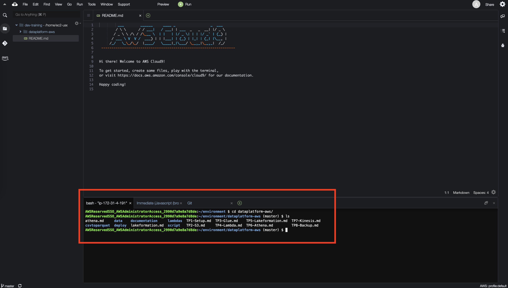

Le but de cet exercice est de déployer de prendre en main cloudformation/sceptre et de vérifier que vous êtes en mesure 
de déployer des stacks sur vos comptes.


## Étape 1 : Connexion à Cloud9
Aller sur le service cloud 9 en cliquant directement [sur ce lien](https://eu-west-1.console.aws.amazon.com/cloud9/home?region=eu-west-1)

Un environnement a été créé, ouvrer l'IDE


L'IDE est ouvert, il faut à présent cloner le repository github de la formation.
Choisisez *Clone Repository* et rentrer l'url suivante : https://github.com/xebia-france/dataplatform-aws.git et appuyer sur la touche *Entrer"


Les exercices sont exécutable via une CLI afin de centraliser les commandes. Pour cela, assurer vous d'être dans le 
dossier `dataplatform-aws` 
```shell
cd dataplatform-aws/
./deploy/sapient-formation.sh
```


## Étape 2 : Installation de Sceptre
Dans l'onglet bash lancer la commande suivante pour installer sceptre
```
pip install sceptre --user
```

## Étape 3 : Configurer votre nom
Le nom des buckets étant unique, nous allons configurer globalement dans sceptre la variable `trainee` qui servira à nommer le bucket.
La valeur doit être en **minuscule**, peut contenir des chiffres et des “.”. *ATENTION* ne pas utiliser le character "-", nous utilisons ce character comme separateur pour certains jobs. 

Fichier **deploy/cloudformation/variables.default.yaml**
```yaml
trainee: <A REMPLACER>
```

Exemple
```yaml
trainee: jpinsolle
```

## Étape 4 : Deploiement des stacks de base
Déployer les stack suivantes sur l'environnement `dev`
 * dev-dataplatform-kms
 * dev-dataplatform-s3
 * dev-dataplatform-ecr
 
```
./deploy/sapient-formation.sh tp1-deploy-kms dev
./deploy/sapient-formation.sh tp1-deploy-s3 dev phone
./deploy/sapient-formation.sh tp1-deploy-ecr dev
```

Vérifier les stacks déployées dans [le service cloudformation](https://eu-west-1.console.aws.amazon.com/cloudformation/home?region=eu-west-1)

## Étape 5 : 
Ajouter les outputs pertinents à vos stacks. Notez les différentes possibilités pour récupérer les valeurs
de retour de chaque ressource `Ref` pour le BucketName et `!GetAtt` pour l'ARN du bucket.

Voir la liste des possibilités pour les curieux : [S3](https://docs.aws.amazon.com/AWSCloudFormation/latest/UserGuide/aws-properties-s3-bucket.html#aws-properties-s3-bucket-return-values),
[KMS](https://docs.aws.amazon.com/AWSCloudFormation/latest/UserGuide/aws-resource-kms-key.html#aws-resource-kms-key-return-values)

**deploy/cloudformation/templates/tp1/kms.yaml**
```yaml
Outputs:
  KMSKeyArn:
    Value: !GetAtt KMSKey.Arn
```

```
./deploy/sapient-formation.sh tp1-deploy-kms dev
```

**deploy/cloudformation/templates/tp1/s3.yaml**
```yaml
Outputs:
  BucketName:
    Value: !Ref Bucket

  BucketArn:
    Value: !GetAtt Bucket.Arn
```

```
./deploy/sapient-formation.sh tp1-deploy-s3 dev phone
```

**Résultat**

