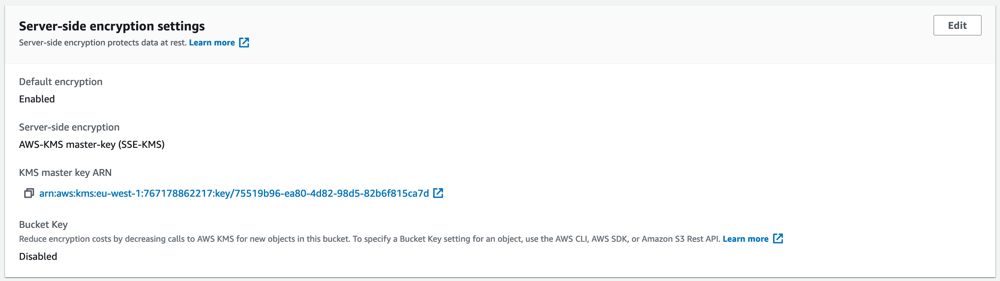

Le but de cet exercice est d'enrichir la configuration du bucket S3 du TP1.
* Versioning
* Chiffrement par défaut
* Life cycle pour passer les vieux fichiers en IA 
* Interdiction des écriture faites via un protocole non sécurisé


Assurer vous d'être dans le dossier `dataplatform-aws` 
```shell
cd dataplatform-aws/
git checkout tp2
```

## Étape 1 (Versioning)
Activer le versioning, [voir la documentation](https://docs.aws.amazon.com/AWSCloudFormation/latest/UserGuide/aws-properties-s3-bucket.html#cfn-s3-bucket-versioning)

Le fichier à modifier est deploy/templates/tp2/s3.yaml. Une fois le versioning activé, lancer sceptre
 
```shell
./deploy/sapient-formation.sh tp1-deploy-s3 dev titanic
```

## Étape 2 (Chiffrement)
### ARN de la clé KMS
Ajouter le paramètre `KMSKeyArn` à la stack. Sa valeur est l'output `KMSKeyArn` de la stack `dev-dataplatform-kms`

Fichier **deploy/cloudformation/config/tp2/s3.yaml**
```
KMSKeyArn: !stack_output_external {{ var.environment }}-dataplatform-kms::KMSKeyArn
``` 

Fichier **deploy/cloudformation/templates/tp2/s3.yaml**
```
KMSKeyArn:
    Type: String
``` 

### ARN de la clé KMS
Il faut maintenant utiliser le paramètre `KMSKeyArn` dans la configuration du bucket [voir documentation](https://docs.aws.amazon.com/AWSCloudFormation/latest/UserGuide/aws-properties-s3-bucket.html#cfn-s3-bucket-bucketencryption)


## Étape 3 (Life cycle)
Passer les fichiers du prefix `raw-data` dans la classe `STANDARD_IA` au bout de 45 jours,
[voir la documention](https://docs.aws.amazon.com/AWSCloudFormation/latest/UserGuide/aws-properties-s3-bucket.html#cfn-s3-bucket-lifecycleconfig)

## Étape 4 (Bucket Policy)
Par défaut S3 autorise les accès en HTTP et en HTTPS, il est recommandé d'interdire les accès non HTTPS. Pour ce faire,
il suffit d'ajouter une bucket policy.

[Ressource AWS::S3::BucketPolicy](https://docs.aws.amazon.com/AWSCloudFormation/latest/UserGuide/aws-properties-s3-policy.html)

Regarder l'exemple pour avoir la structure de `PolicyDocument`. Les propriétés à mettre sont les suivantes :
* Effect = Deny
* Principal = Tout le monde (*)
* Action = Toutes les actions s3 (s3:*)
* Resource = Arn du bucket ainsi que les sous prefixes
* Condition = Type Bool `aws:SecureTransport: "false"`


## Étape 5 Upload de données dans le bucket

Pour vérifier que votre configuration est correcte (chiffrement et versioning), vous pouvez uploader un fichier dans le bucket.

```shell
# L'upload du fichier se fait sans spécifier de chiffrement, la configuration du bucket entre en jeu
aws s3 cp data/titanic/passengers.csv s3://<trainee>-source-titanic-dev/incoming/2021-03-30__passengers.csv
```

Quand vous naviguez à l'aide de la console AWS sur le fichier, vous devriez voir que ce dernier est chiffré avec votre clé KMS.


Si a présent vous le supprimez, vous serez toujours en mesure de le récupérer grâce aux précédentes versions.
```shell
aws s3 rm s3://<trainee>-source-titanic-dev/incoming/2021-03-30__passengers.csv
```


