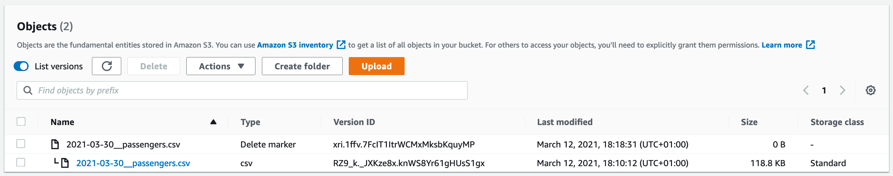

Le but de cet exercice est d'enrichir la configuration du bucket S3 du TP1
* Versioning
* Chiffrement par défaut
* Life cycle pour passer les vieux fichiers en IA 
* Interdiction des écriture faites via un protocole non sécurisé


Assurez-vous d'être dans le dossier `dataplatform-aws` 
```shell
cd dataplatform-aws/
```

## Étape 0 : Configurer votre nom
Le nom des buckets étant unique, nous allons configurer globalement dans sceptre la variable `trainee` qui servira à nommer le bucket.

Fichier **deploy/cloudformation/variables.default.yaml**
```yaml
trainee: <A REMPLACER>
```

Exemple 
```yaml
trainee: jpinsolle
```

## Étape 1 : Versioning
Activer le versioning, [voir la documentation](https://docs.aws.amazon.com/AWSCloudFormation/latest/UserGuide/aws-properties-s3-bucket.html#cfn-s3-bucket-versioning)

Le fichier à modifier est deploy/templates/tp2/s3.yaml. Une fois le versioning activé, lancer sceptre
 
```shell
./deploy/sapient-formation.sh tp1-deploy-s3 dev phone
```

## Étape 2 : Chiffrement
Le but est de chiffrer le bucket avec la clé KMS du TP1

### ARN de la clé KMS
Ajouter le paramètre `KMSKeyArn` de type `String` à la stack. Sa valeur est l'output `KMSKeyArn` de la stack `dev-dataplatform-kms`

Fichier **deploy/cloudformation/config/tp2/s3.yaml**
```
KMSKeyArn: !stack_output_external {{ var.environment }}-dataplatform-kms::KMSKeyArn
``` 

Fichier **deploy/cloudformation/templates/tp2/s3.yaml**
Ajouter le paramètre `KMSKeyArn`
```
KMSKeyArn:
    Type: String
```

### Propriété BucketEncryption
Compléter la ressource `Bucket` avec la propriété [BucketEncryption](https://docs.aws.amazon.com/AWSCloudFormation/latest/UserGuide/aws-properties-s3-bucket.html#cfn-s3-bucket-bucketencryption)

### Déployer
```
./deploy/sapient-formation.sh tp1-deploy-s3 dev phone
```

## Étape 3 : Life cycle
Passer les fichiers du prefix `raw-data` dans la classe `STANDARD_IA` au bout de 45 jours,
[voir la documention](https://docs.aws.amazon.com/AWSCloudFormation/latest/UserGuide/aws-properties-s3-bucket.html#cfn-s3-bucket-lifecycleconfig)

Déployer
```
./deploy/sapient-formation.sh tp1-deploy-s3 dev phone
```

## Étape 4 : Autoriser uniquemement les fichiers chiffrés
Ajouter dans le template une nouvelle ressource : [Ressource AWS::S3::BucketPolicy](https://docs.aws.amazon.com/AWSCloudFormation/latest/UserGuide/aws-properties-s3-policy.html)

### Interdire S3-SSE
Regarder l'exemple pour avoir la structure de `PolicyDocument`. Les propriétés à mettre sont les suivantes :
* Sid = Deny S3-SSE
* Effect = Deny
* Principal = Tout le monde (*)
* Action = s3:PutObject
* Resource = Arn du bucket avec les sous prefixes `!Sub "arn:aws:s3:::${Bucket}"`
* Condition = Type `StringEquals` `s3:x-amz-server-side-encryption: "AES256"`

### Interdire les autres clés KMS
* Sid = Deny other keys
* Effect = Deny
* Principal = Tout le monde (*)
* Action = s3:PutObject
* Resource = Arn du bucket avec les sous prefixes `!Sub "arn:aws:s3:::${Bucket}"`
* Condition = Type `StringNotLikeIfExists` `s3:x-amz-server-side-encryption-aws-kms-key-id: !Ref KMSKeyArn`


## Étape 5 Upload de données dans le bucket

Pour vérifier que votre configuration est correcte (chiffrement et versioning), vous pouvez uploader un fichier dans le bucket.

```shell
# L'upload du fichier se fait sans spécifier de chiffrement, la configuration du bucket entre en jeu
aws s3 cp data/phone/customer.csv s3://<trainee>-source-phone-dev/incoming/customers.csv
aws s3 cp data/phone/customer.csv s3://<trainee>-source-phone-dev/incoming/2021-01-01__calls.csv
```

Quand vous naviguez à l'aide de la console AWS sur le fichier, vous devriez voir que ce dernier est chiffré avec votre clé KMS.


Uploader un fichier en spécifiant le chiffrement S3-SSE. Une erreur se produira car la bucket policy l'interdit
```
aws s3 cp data/phone/customer.csv s3://<trainee>-source-phone-dev/incoming/customers.csv --sse AES256
upload failed: data/phone/customers.csv to s3://<trainee>-source-phone-dev/customers.csv An error occurred (AccessDenied) 
when calling the PutObject operation: Access Denied
```


Si a présent vous supprimez le fichier, vous serez toujours en mesure de le récupérer grâce aux précédentes versions.
```shell
aws s3 rm s3://<trainee>-source-phone-dev/incoming/2021-03-30__passengers.csv
```



