#LakeFormation Workshop
Le but de cet exercice est d'utiliser lake formation pour sécuriser l'accès à des données requêtées via Athena.

Nous utiliserons aussi un crawler pour alimenter notre data platform.

##Le use case
Nous avons reçu dans notre centre d'appels, des données sensibles que l'on doit gérer sur notre dataplatform, les passagers du titanic.

Le but d'avoir ces données et de contacter par la suite la famille des rescapés pour une offre promotionnelle.

Cependant, pour restreindre l'accès aux données sensibles à notre nouveau data analyst fraîchement recruté, nous souhaitons, via lake formation,
ne laisser l'accès qu'aux colonnes `pclass`,`name`, `age` de cette table.

##Déroulement de l'exercice
Pour répondre à ce besoin nous allons tout d'abord lancer une stack cloudformation qui nous créera le user `DataAnalyst et certains pré-requis.

Nous allons par la suite ingérer la donnée via crawler.

Et finalement nous allons, via la console (car malheureusement ce niveau de droit assez fin n'est pas gérable par cloudformation),
octroyer les droits à notre data analyst.

## Étape 1 : Activer les droits LakeFormation sur les données 
Cette étape, qui ne peut être configurée avec cloud formation pour le moment, doit se faire sur la console.

Reportez vous donc, sur la console, connectez vous avec votre compte principal et ouvrez le service LakeFormation.

Une fois cela fait, désactiver les deux cases suivantes qui empêcheront d'appliquer les droits IAM aux databases et tables
qui seront prochainement créées :
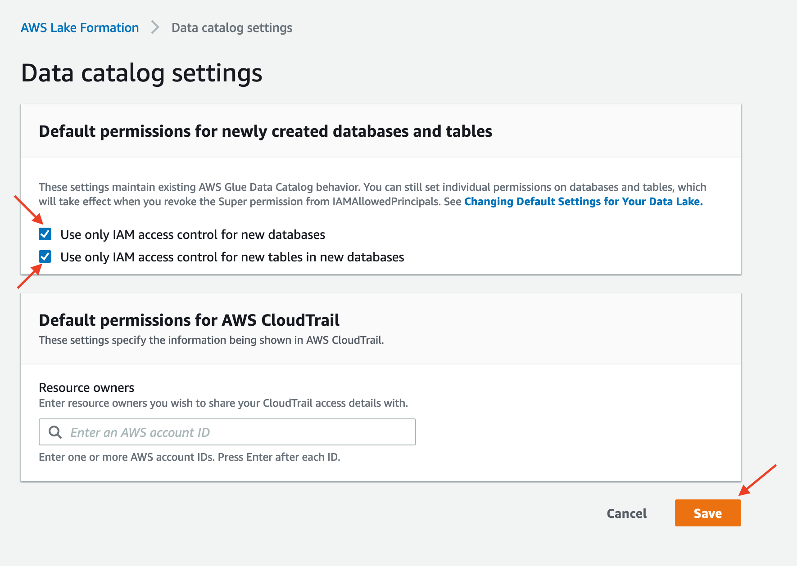

## Étape 2 : Lancer la stack cloudformation de configuration du service LakeFormation

À cette étape nous allons créer le user DataAnalyst, configurer son rôle, configurer l'administrateur du service LakeFormation,
mais aussi créer un crawler et configurer ses droits LakeFormation pour alimenter la table.

Pour se faire, assurez-vous d'être dans le dossier `dataplatform-aws` 
```shell
cd dataplatform-aws/
```
Ensuite déployer la stack
```shell
./deploy/sapient-formation.sh tp5-deploy-lakeformation-workshop dev
```

En attendant le déploiement, voyons en détail les resources créées et les configurations intéressantes de cette stack:

* ####Définition de l'admin lakeformation:
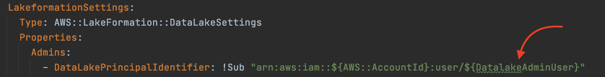
  Nous allons à ce niveau référencer l'administrateur des données sur LakeFormation. Dans notre cas nous avons spécifier un user,
  qui en l'occurence sera vous même, mais dans un contexte hors démo, il est possible de le rajouter à un rôle IAM existant et de l'affecter à plusieurs users.
  

* ####Rajout des permissions LakeFormation au role du crawler créé:
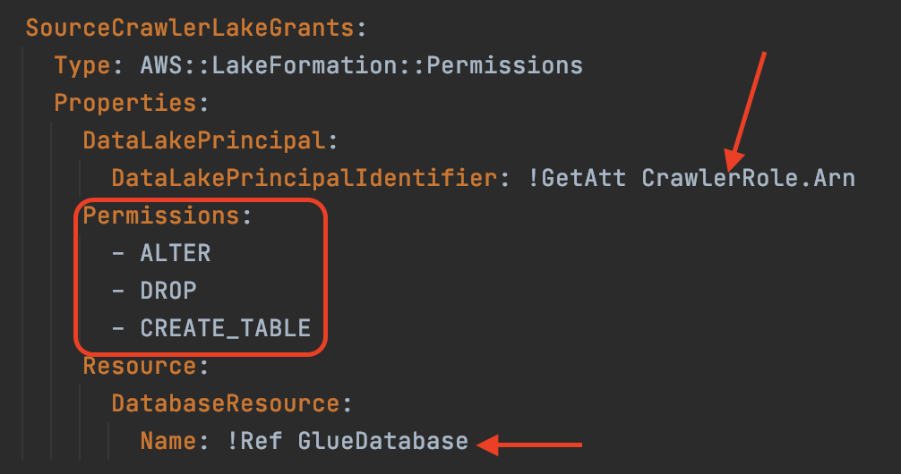
Notez que les dorits sont ocrtoyés à une seul database et sont restreint uniquement à la modification, suppression et création des tables.
  
* ####Définition du DataLake location au niveau du service LakeFormation
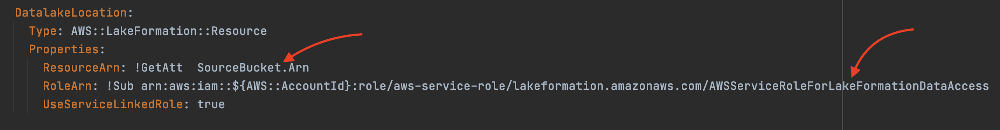
Cette étape permettra de définir où seront stockés mes données et où les règles LakeFormation vont s'appliquer.

* ####Définition du user DataAnalyst
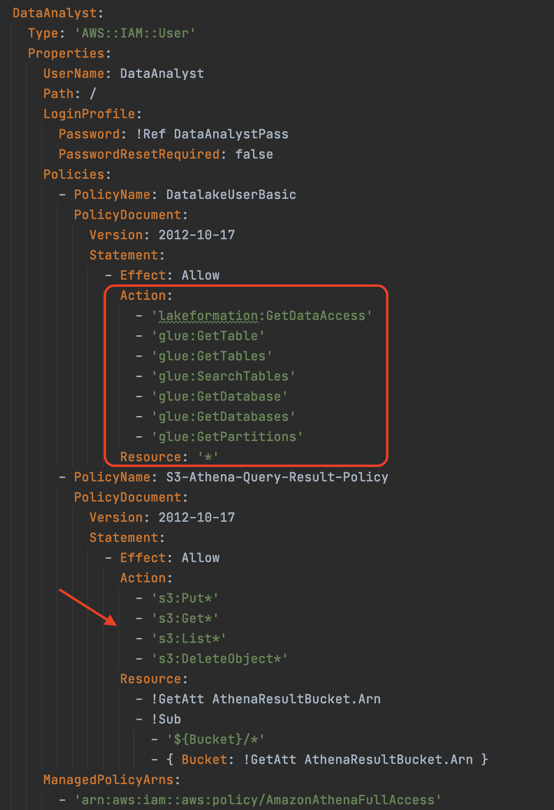
Notez les droits retreints du user et comment est configuré l'application des droits LakeFormation.
Notez aussi le rajout des droits pour pouvoir écrire le resultat des requêtes Athena dans le bucket dédié.

## Étape 3 : Rajouter les droits sur les données pour le crawler
Actuellement, nous avons affecté des droits uniquement au niveau des tables (au sens Glue) mais pas aux données sauvegardés dans S3.
Pour cela nous allons utiliser la console pour octroyer ces droits, et les rajouter au rôle du crawler:
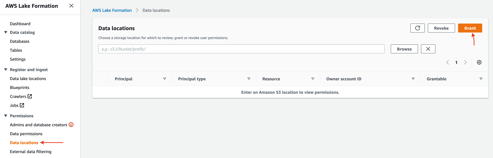
Puis :
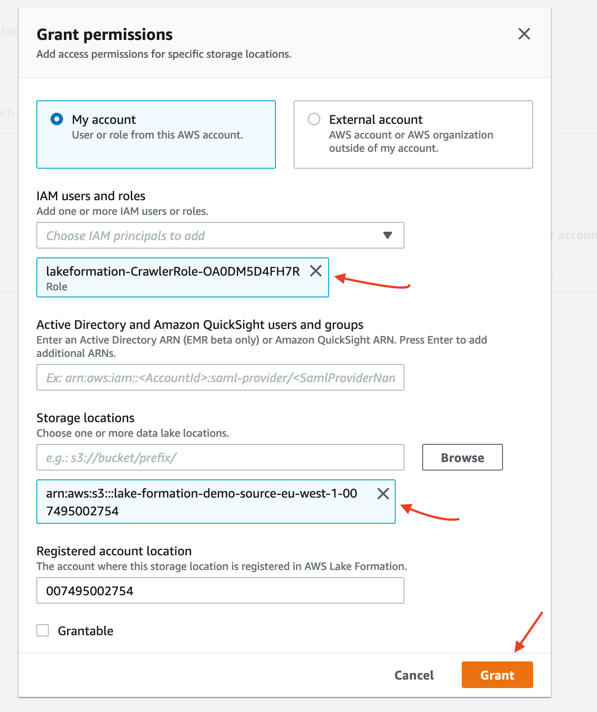

## Étape 4 : Déposer le fichier sur S3 et lancer le crawler

```shell
Remplacer par votre account ID
aws s3 cp data/titanic/passengers.csv s3://lake-formation-demo-source-eu-west-1-<AWS::AccountId>/passengers.csv
```

Puis:
```shell
aws glue start-crawler --name lake-formation-demo-crawler
```

## Étape 5 : Donner les droits requis au data analyst
Dans cette étape, nous allons affecter les droits nécessaires au data analyst avec Lake Formation.
Pour cela, accéder au service Lake Formation puis dans le panel `Tables` cliquez sur `Grant` en sélectionnant la table nouvellement créée:
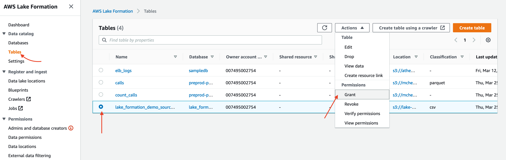

À ce niveau, sélectionner le user créé avec les droits désirés, notez aussi qu'on peut faire l'opération inverse, 
en ne donnant pas accès à certaines colonnes. De plus, si l'on souhaite, notre user pourra lui même affecter des droits à un autre user si
on coche les cases `Grantable permissions`:
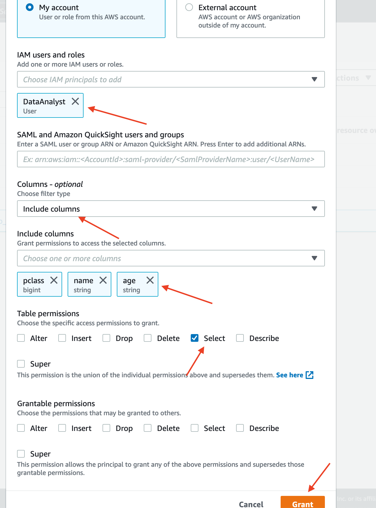

## Étape 6 : Tester les droits en tant que data analyst:
Connectez vous via un autre navigateur web ou dans un onglet privé à l'interface de connexion de la [Console AWS](https://console.aws.amazon.com).
Puis renseignez votre ID de compte, le user `DataAnalyst` ainsi que son mot de passe `Azerty123!`.
Reportez-vous ensuite sur le service Athena et configurer le bucket de sortie des requêtes:
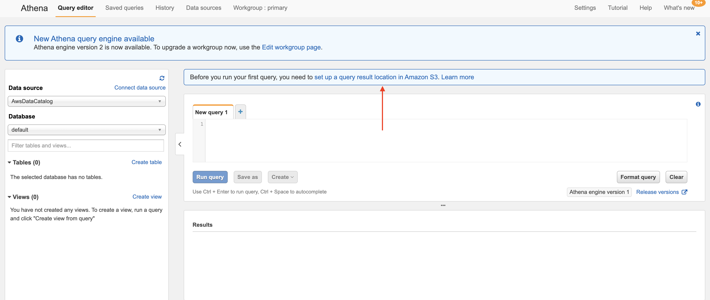
Puis :
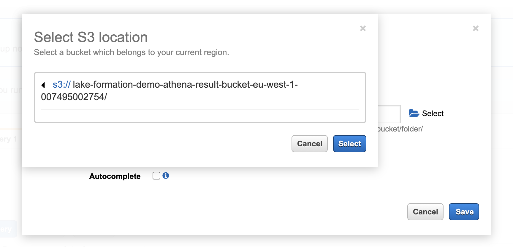

Réaliser un select sur la table et notez qu'on a que les colonnes, définit plus haut qui sont exposés et pas les autres:
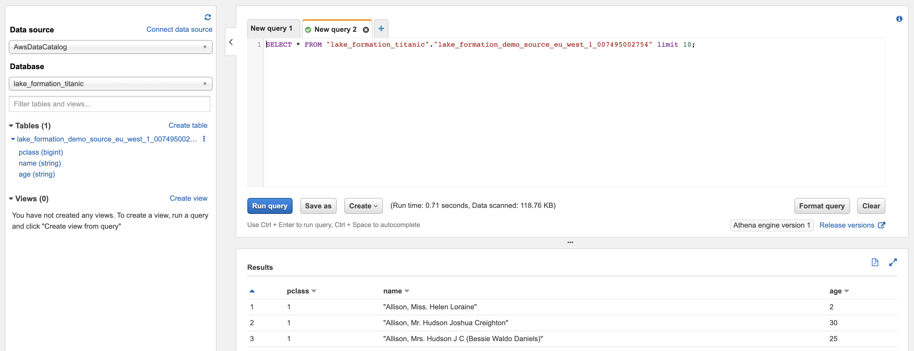

Essayez maintenant de supprimer cette table, vous constaterez que ce n'est pas possible, une erreur `Insufficient Lake Formation Permission(s)`est remontée: 
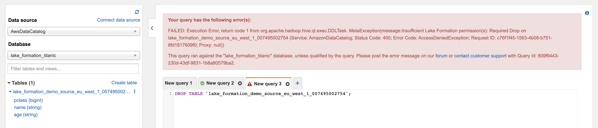