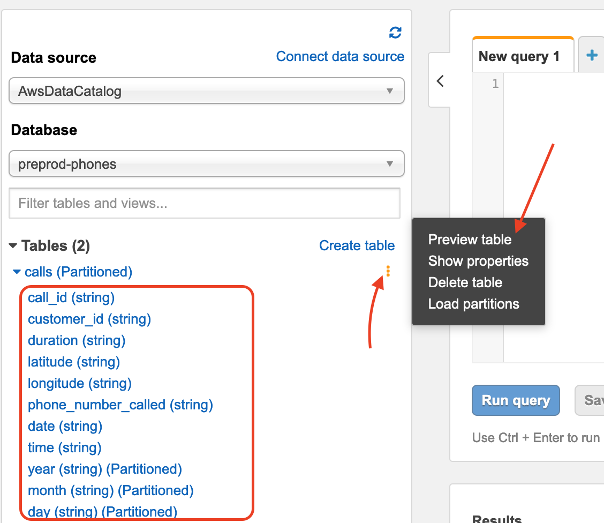
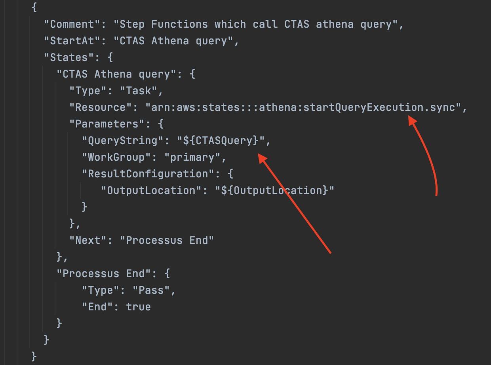
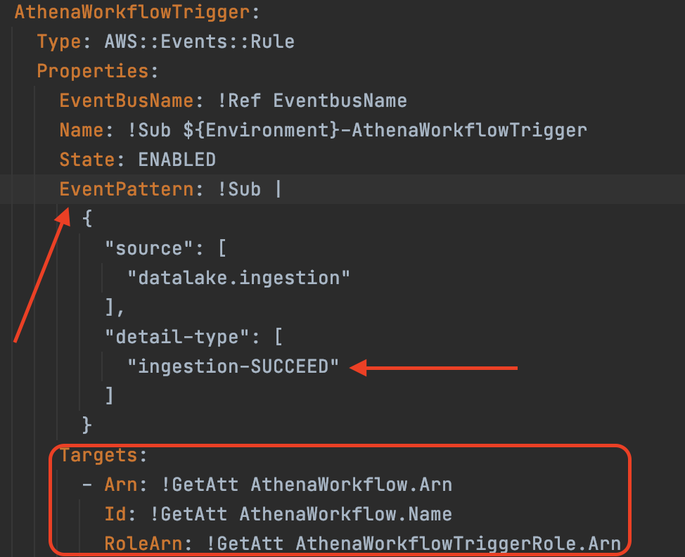

# Athena Workshop
Le but de cet exercice est de manipuler des requêtes Athena via la console et via les stepfunctions.

## Le use case
Nous avons déjà en place une table `calls` qui contient les appels référencés par notre centre d'appel.
Nous souhaitons dans un premier pouvoir visualiser et faire quelques analyses sur les données. et compter le nombre de lignes de la table via Athena.
Ensuite nous souhaitons créer une table nommée `count_calls` qui contient la durée max d'un appel pour chaque `customer` 
en l'an 2021, trié de façon descendante (du plus grand au plus petit) sur cette durée max.
Idéalement on souhaiterai faire tourner cette requête dès que le job d'ingestion soit terminé.


## Étape 1 : Exécuter des requêtes Athena
Rendez-vous sur le service Athena puis avant toute chose configurez l'endroit de sauvegarde des données sur le bucket source des données.
Une fois l'endroit de sauvegarde renseigné, choisissez la database créé par le job Glue en l'occurence `dev-phones`.
Vous remarquerez la table nouvellement créée ainsi que leur colonnes et leur typages.
Visualisez les données en cliquant sur `Preview table`:


Maintenant modifier la requête pour calculer le nombre de ligne de notre table:
```shell
select count(*) from "dev-phone".calls
```
## Étape 2 : Exécuter une requête CTAS via Athena
A présent pour calculer la requête d'analyse et la stocker dans une table dédiée, utilisez la CTAS suivante:
```shell
CREATE table IF NOT EXISTS "dev-phone".count_calls
    WITH (format='PARQUET',parquet_compression='SNAPPY',partitioned_by=array['year'])
    AS SELECT customer_id,max(cast(duration as INTEGER)) as max_duration , year
    FROM "dev-phone".calls
    group by customer_id,year
    having year='2021'
    order by max_duration desc
```
Remarquez la facilité d'utilisation pour répondre à ce besoin. Cette requête comporte une compression en parquet, un partitionnement, 
une aggrégation, un filtre et un cast sur les données !

NB: Supprimez la table avant de passer à l'étape suivante.

## Étape 3 : Industrialisation de la CTAS
Pour ne pas exécuter cette requête à la main, nous allons l'industrialiser dans une step function,
qui sera elle même lancée que si la step function d'ingestion est en état `SUCCEED`.
Pour se faire, assurez-vous d'être dans le dossier `dataplatform-aws` 
```shell
cd dataplatform-aws/
```
Ensuite déployer la stack
```shell
./deploy/sapient-formation.sh tp6-deploy-athena-workshop dev phone
```
En attendant la création de la stack, discutons un peu de la stack créé:
    * Notez comment est configurée la state machine:

    * Notez aussi comment configuré l'eventRule:



Après la fin du déploiement de la stack veuillez déposer un fichier dans le bucket source à l'endroit approprié pour lancer 
les traitements.


