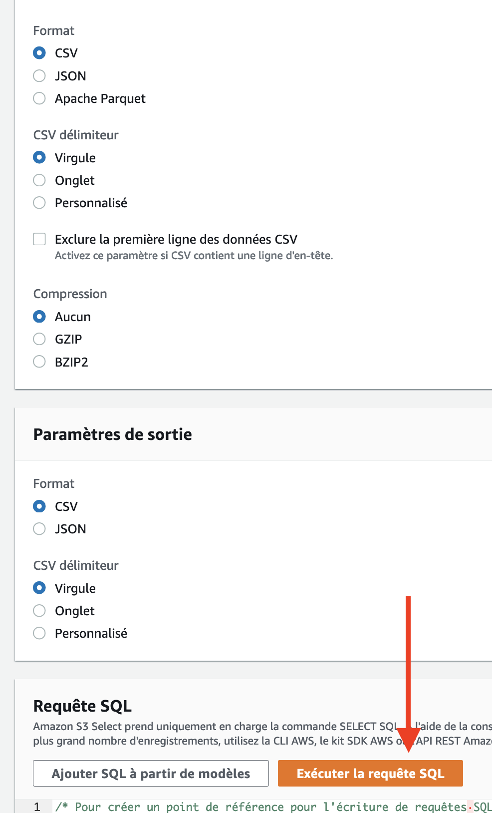

#Kinesis Workshop
Le but de cet exercice est de déployer une application en temps réel via Kinesis.

##Le use case
On reçoit sur notre dataplatform des events qui contiennent un UUID ainsi que l'endroit d'où a été généré l'event,
le but de l'exercice est de filtrer ces events, par état, et de ne garder que l'état de New York --> "NY".
Cependant, dans ces events reçus il y a des départements français qu'on souhaiterai mettre en erreur.


##L'architecture de l'exercice


## Déroulement de l'exercice
Pour faciliter l'apprentissage, nous allons tout d'abord déployer la stack cloudformation qui déploie cette architecture 
et ensuite discuter des différents éléments qui la compose.


## Étape 1 : Etude du stream Kinesis FireHose
Le stream Kinesis Firehose créé a une configuration intéressante du fait qu'il est configuré pour écrire dans un bucket particulier
tout en appliquant une transformation à la volée sur les données.
Voici sa configuration:

Il est composé de:
* Flèche 1: Le rajout de l'extension sur S3
* Flèche 2: Réglage du buffering sur les données (50Mb ou 60sec)
* Flèche 3: Il est possible aussi de compresser les données en ORC ou Parquet en même temps, pour notre besoin ce la n'a pas été utile
* Rectangle 4: Le rajout de la configuration de la lambda de processing
* NB: Vous pouvez noter aussi qu'on peut déposer les données dans un chemin particulier en utilisant la partie ```Prefix```


## Étape 3 : Lancement de la stack Kinesis
Cette étape nous permettra de déployer:

* Un bucket S3 qui contiendra les données résultantes
* Un kinesis Firehose stream qui contiendra nos données
* Une lambda qui réalisera le filtre sur les données

Avant de commencer assurez-vous d'être dans le dossier `dataplatform-aws` 
```shell
cd dataplatform-aws/
```
Ensuite déployer la stack
```shell
./deploy/sapient-formation.sh tp7-deploy-kinesis-workshop dev
```

En output de cette stack vous aurez:
* Le nom du bucket S3 créé
* Le nom du stream Kinesis Firehose créé

NB: Nous évoquerons dans le détail les éléments créés via ce template dans la suite de l'exercice.

## Étape 3 : Etude la lambda qui filtre les données
Pour répondre à notre besoin, il est possible d'appeler une lambda pluggé sur Kinesis Firehose pour effectuer nos traitements.
Elle sera appelée à chaque fois que la configuration du buffering est atteinte.

Veuillez-vous reporter sur le service Lambda et consulter le code de la lambda préfixé par ````dev-dataplatform-kinesis-wor-ProcessLambdaFunction````

Le traitement consiste:
* 1. À récupérer l'event reçu ````exports.handler = async (event, context) ````
* 2. Boucler sur les records envoyés par l'event et appliquer la fonction de traitement ````const output = event.records.map((record) => filter(record)); ````
* 3. Retourner les records traités  `````return { records: output };`````
* NB: Notez dans la fonction filter les trois types de record retournés :
    * Pour les records supprimés, le result est à ```Dropped```
      ```shell
      return {
          recordId: record.recordId,
          result: 'Dropped',
          data: record.data
      }
      ```
    * Pour les records en fail, le result est à ```ProcessingFailed```
      ```shell
      return {
          recordId: record.recordId,
          result: 'ProcessingFailed',
          data: record.data
      }
      ```
    * Pour les records gardés, le result est à ```Ok```
      ```shell
      return {
          recordId: record.recordId,
          result: 'Ok',
          data: record.data
      }
      ```
* NB2: Notez aussi en ligne 12 comment la nouvelle payload a été construite:
```shell
  (new Buffer(`New York State found !! for entry: ${entry}`, 'utf8')).toString('base64');
  ```


## Étape 4 : Envoi des données vers Kinesis
Pour procéder à l'envoi de ces events nous utiliserons un code python qui générera de la donnée ce type:
```
{uuid: State} exemple: {"550e8400-e29b-41d4-a716-446655440000":"NY"}
```
Ce code python générera des uuid et des états random de façon continu, chaque seconde.

Il prendra en paramètre le nom du stream qu'il faudra récupérer de l'output du template cloudformation créé en étape 1.

Prenez quelques secondes pour lire ce code Python existant dans: 
```
script/tp7/putRecordsKinesis.py
```
Remarquez que nous utilisons la fonction ```putRecord```.

Pour lancer le script, veuillez exécuter la commande suivante en utilisant le bon nom du stream Kinesis:
```shell
python script/tp7/putRecordsKinesis.py <Nom du stream Kinesis créé>
```
## Étape 5 : Verification des données
Après l'envoi de quelques events via le code Python, vous pouvez arrêter le script.

Veuillez vous reportez sur le service S3 et consulter le bucket créer par la stack cloud formation.

Notez que notre préfixe à bien été pris en compte en appliquant générant des données dans le dossier ```firehose```

Ce dossier comportera les records en fail, ainsi que les records ayant le statut 'Ok'.

Les fichiers déposés sont répetoriés dans une arborescence `/Année/Mois/Jour/Heure` qui correspond à la date de production du fichier.

Pour consulter facilement un fichier, utilisons la fonction Query with S3 Select du service S3:


Puis:


