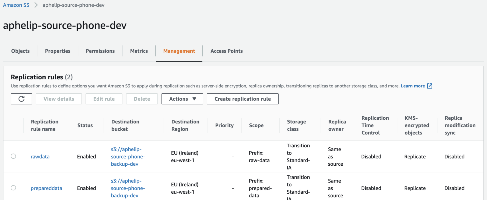

Le but de cet exercice est de paraméter le backup du bucket de données dans un autre bucket. 

Le fichier de l'exercice est le suivant `tp8/s3.yaml`. Cette stack reprend la stack s3 du TP2. Elle a le même nom. 

Le but est de modifier la configuration du bucket déjà créé pour activer le backup.

Vous pouvez si vous préférez partir de votre propre template du TP4. Parcourez dans tous les cas le template du TP8, plusieurs choses ont été ajoutées : 
* La partie `ReplicationConfiguration` dans la définition du bucket principal à compléter
* La définition du bucket de backup et de sa policy associée à compléter
* La définition du rôle pour le backup qui vous est fournit


## Étape 1 : Décrire la configuration de la replication
Dans le bucket de données, complétez la partie `Rules` de la `ReplicationConfiguration`. Paramétrez le backup des prefix `raw-data` et `prepared-data`.

Aidez-vous de la [documentation Cloudformation pour cela](https://docs.aws.amazon.com/fr_fr/AWSCloudFormation/latest/UserGuide/aws-properties-s3-bucket-replicationconfiguration.html).

Vous aurez besoin de préciser la clé KMS à vos règles.

## Étape 2 : Créer le bucket de Backup et sa policy
Rien de particulier ici, c'est la même chose que pour la création du bucket principal. Pensez bien à n'autoriser que les connexions sécurisées.

## Étape 3 : Déployer la nouvelle configuration du bucket
Une fois arrivé ici vous pourrez déployer la nouvelle configuration du bucket ainsi que le bucket de backup. 

```shell
./deploy/sapient-formation.sh tp8-deploy-s3-with-backup dev phone
```

Vous risquez de rencontrer un problème de dépendances cyclique. 
En effet le bucket principal a besoin du rôle `ReplicationRole` mais ce dernier utilise le bucket principal dans sa définition. 
À vous de trouver une solution pour contrer ce problème.

Indice : `ReplicationRole` n'a besoin que du nom du bucket principal.

## Étape 4 : Vérifiez que la réplication est active
Vérifiez depuis la console que la replication est bien activée (depuis la page du bucket dans l'onglet Management).


Déposez un fichier sur le bucket principal et vérifiez qu'il se réplique bien dans le bucket principal (il y a une latence de quelques secondes)
