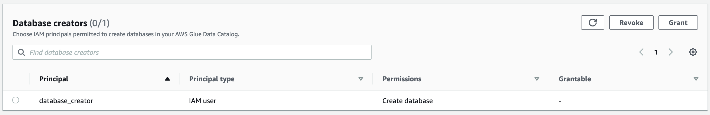
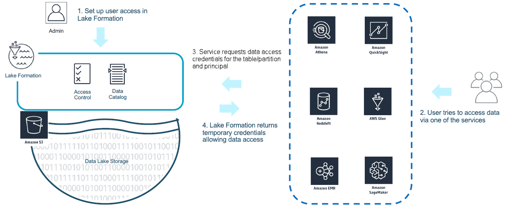
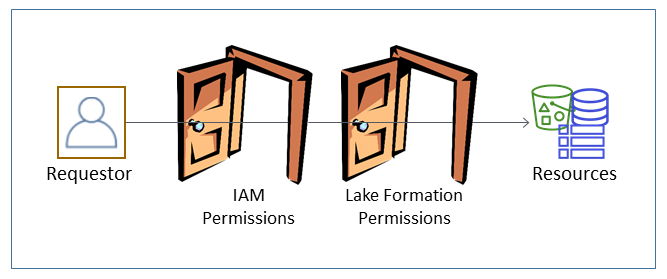

# AWS Lake Formation

Les fonctionnalités :
- Gestion des droits sur les données à travers le catalogue Glue


### Rétrocompatibilité
Afin de maintenir la rétrocompatibilité avec le fonctionnement historique de Glue (gestion des droits uniquement par IAM)
Lake Formation ajoute la permission `Super` au group `IAMAllowedPrincipals`

IAMAllowedPrincipals n'est pas un groupe IAM au sens propre, mais juste une dénomination Lake Formation. 
Vous ne le verrez donc pas dans la console AWS.

## Les personas
### Data lake administrators  
Son but est d'administrer le lake en donnant ou révoquant des accès.
* Droits d'accès en lecture sur toutes les ressources dans Data Catalog (attention pas au données)
* Donner ou révoquer les accès sur n'importe quelles ressources du Data Catalog
* Créer des bases de données dans le Data Catalog
* Donner les permissions de créer des bases de données à d'autres utilisateurs

Les administrateurs ne disposent pas d’autorisations implicites pour supprimer des bases de données ou modifier/supprimer 
des tables créées par d’autres. Cependant, ils peuvent s’accorder eux-mêmes des autorisations pour le faire. 

Les administrateurs se rajoutent via `put-data-lake-settings`.

### Database creators  
Un créateur de base de données est un principal qui a la permission Lake Formation `CREATE_DATABASE`. 

Une fois la base de donnée créée, le `Database creator` ne peux pas créer des tables, il lui faudra les droits appropriés.
Les `Data lake administrators` sont également `Database creators` car ils peuvent créer des bases de données.

Le créateur de base de donnée se créé via la commande standard d'ajout de permissions `aws lakeformation grant-permissions`.
```bash
aws lakeformation grant-permissions \
    --principal DataLakePrincipalIdentifier=<USER_ARN> \
    --permissions CREATE_DATABASE 
    --resource '{"Catalog": {}}'
```
Une fois la permission ajoutée, il sera visible dans le pannel dédié


### Data Analyst
Le Data Analyst est un utilisateur humain qui a besoin 
* de droit de lecture sur toutes les tables de certaines bases de données
* de droit de lecture sur certaines tables de certaines bases de données
* de droit d'écriture dans d'autres bases afin de créer de nouveau jeux de données

```bash
# Droit de lecture sur toutes les tables de la base de donnée "titanic"
aws lakeformation grant-permissions \
    --principal DataLakePrincipalIdentifier=<USER_ARN> \
    --permissions SELECT CREATE_TABLE \
    --resource '{"Table": { "DatabaseName": "titanic", "TableWildcard": {}} }'

# Droit de création de tables dans la base de données business-data
aws lakeformation grant-permissions \
    --principal DataLakePrincipalIdentifier=arn:aws:iam::767178862217:user/data_analyst \
    --permissions CREATE_TABLE \
    --resource '{"Database": { "Name": "dev-business-data"} }'

# Droit sur la location S3 business-data pour écrire les données
aws lakeformation grant-permissions \
    --principal DataLakePrincipalIdentifier=arn:aws:iam::767178862217:user/data_analyst \
    --permissions DATA_LOCATION_ACCESS \
    --resource '{"DataLocation":{"ResourceArn":"arn:aws:s3:::jpinsolle-business-data-dev"}}'
```

Suppression des permissions
```bash
aws lakeformation revoke-permissions \
    --principal DataLakePrincipalIdentifier=<USER_ARN> \
    --permissions SELECT \
    --resource '{"Table": { "DatabaseName": "titanic", "TableWildcard": {}} }'
```

## Permissions
Les autorisations Lake Formation ne s'appliquent pas lors de l'écriture d'objets dans Amazon S3, ni lors de l'interrogation 
des données stockées dans Amazon S3 ou des métadonnées qui ne sont pas enregistrées auprès de Lake Formation. 
Pour les données sur S3 et les métadonnées qui ne sont pas enregistrées auprès de Lake Formation, l'accès est déterminé 
par IAM pour les actions S3 et AWS Glue.  

Quiconque souhaitant accédder à des données enregistrées
Anyone using Athena to query data registered with Lake Formation must have an IAM permissions policy that allows the lakeformation:GetDataAccess action.





Lorsqu’un Principal effectue une demande d’accès à des ressources gérés par le Data Catalog, la demande est vérifiée 
à la fois par IAM et par Lake Formation. En d'autres termes cela signifie que le Principal doit avoir les droits sur 
l'API AWS ainsi que les droits dans Lake Formation.  
Cela est valable pour toutes les requêtes d'accès à Glue. L'accès aux données sur S3 n'est pas régi par les double portes.
Ainsi le Principal n'a pas besoin d'avoir les droits sur S3 pour lire les données. Uniquement les droits Lake Formation.


Exemple:
* **Cas 1** : Pour créer une base de donnée il faut la permission IAM `glue:CreateTable` ainsi que la permission Lake Formation `CREATE_TABLE`.
Lake Formation se base sur les API AWS pour réaliser les opérations, il apporte une couche supplémentaire pour gérer les accès.
* **Cas 2** : Pour lancer une requête Athena `SELECT * FROM matable` il faut que le Principal ait les droits IAM 
`athena:StartQueryExecution` pour lancer la requête, `s3:PutObject` sur le bucket de résultat des requêtes ainsi que le droit
`SELECT` sur la table dans Lake Formation. L'accès au données `s3:GetObject` sur le bucket du lake et à la clé KMS `kms:Decrypt`
est géré sur le rôle Lake Formation.
  

Par défaut quand vous créez une ressource dans le catalogue Glue (une table par exemple), Lake Formation ajoute les 
permissions `Super` à l'utilisateur à l'origine de la création. Le créateur peut ainsi accéder et modifier les données.

En revanche, si un utilisateur (même administrateur au sens AWS) n'a pas de ligne de droit dans Lake Formation alors
il ne pourra rien faire dans le Data Catalog (création de base de données et de tables impossible notamment).

Vos utilisateurs doivent avoir la permission IAM *lakeformation:GetDataAccess* pour récupérer les permissions Lake Formation. 

## AWS Athena
Les emplacements de résultats de requête Athena dans Amazon S3 ne peuvent pas être enregistrés avec Lake Formation, l'accès
est donc déterminé par IAM.   Les autorisations Lake Formation ne s'appliquent pas à l'historique des requêtes Athena. 
Vous pouvez/devez utiliser les workgroup Athena pour contrôler l'accès à l'historique des requêtes.

### Création de tables via CTAS  

Lake Formation permissions to Amazon S3 do not include the ability to write to Amazon S3. Create Table As Statements (CTAS) 
require write access to the Amazon S3 location of tables. To run CTAS queries on data registered with Lake Formation, 
Athena users must have IAM permissions to write to the table Amazon S3 locations in addition to the appropriate Lake 
Formation permissions to read the data locations. For more information, see Creating a Table from Query Results (CTAS).

# Limitations
* L'intégration avec Cloudformation est très basique
    * Impossible de créer une permission wildcard sur toutes les tables d'une base
    * Impossible de créer une permission CREATE_DATABASE car la property CatalogId n'est pas supporté
    * Impossible de supprimer une permission si la table n'existe plus. Au bout de 3 tentatives l'erreur est ignorée  
    DataAnalystUserPermissions AWS::LakeFormation::Permissions DELETE_FAILED Table: passenger not found. (Service: AWSLakeFormation; Status Code: 400; Error Code: InvalidInputException;)
    * Impossible de créer une permission sur une resource non existente. 
